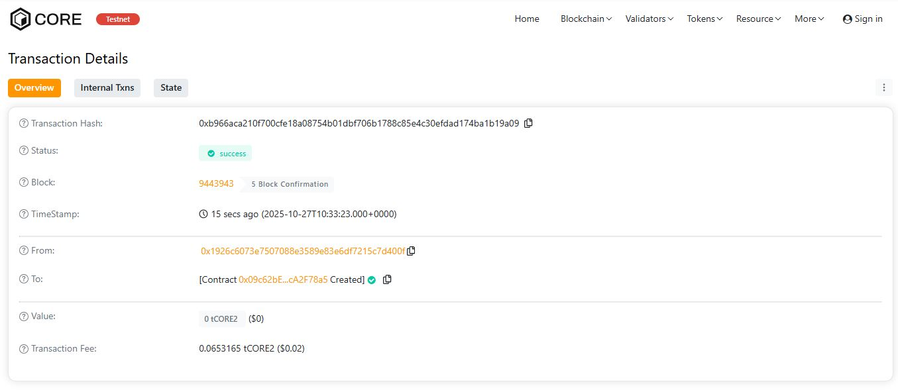

# ProofAxis

## 📘 Project Description
**ProofAxis** is a blockchain-based proof registry that allows users to **create, verify, and retrieve ownership proofs** for digital documents or data using their SHA-256 hashes.  
It provides immutable timestamping and verification, ensuring the integrity and authenticity of any registered record.

---

## 🚀 Project Vision
To empower individuals and organizations with a **trustless, transparent, and decentralized** way to prove the **authenticity and existence** of digital content without relying on intermediaries.

---

## 🔑 Key Features
- **Create Proofs:** Register a document or data hash on-chain with a timestamp and description.
- **Verify Ownership:** Instantly check if a proof exists for a particular hash.
- **Retrieve Metadata:** Fetch proof details such as the owner, creation date, and description.
- **Immutable Records:** Once stored, the proof cannot be modified or deleted.
- **Event Logging:** Emits events for easy off-chain tracking and integration.

---

## 🔭 Future Scope
- **Integration with IPFS** for decentralized storage of actual documents.
- **Role-based Access Control** for enterprise use cases.
- **NFT-based Certification** linked to proof records.
- **User Dashboard** for interacting with proofs via a web interface.
- **Cross-chain Proof Support** to allow interoperability across different blockchains.

---

## ⚙️ Tech Stack
- **Solidity (v0.8.x)**
- **Hardhat** for development and testing
- **Ethereum / EVM-compatible blockchains**

---

## 📄 License
MIT License © 2025 ProofAxis

H address:0xb966aca210f700cfe18a08754b01dbf706b1788c85e4c30efdad174ba1b19a09

